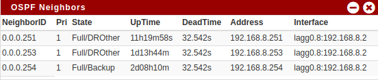

# pfSense OSPF Neighbors widget

A widget to display OSPF neighbors, parsing the output of the "show ip ospf neighbor" command.




# Requirements

the FRR routing package must be installed and OSPF to be configured.


# Usage

1. Copy `widgets` and `include` to pfsense `/usr/local/www/widgets`
2. Enable widget from dashboard.


# Install (run commands from the pfSense commandline)

```
curl https://raw.githubusercontent.com/sublime303/pfSense_ospf_neighbors_widget/main/include/ospf.inc --output --output /usr/local/www/widgets/include/ospf.inc
curl https://raw.githubusercontent.com/sublime303/pfSense_ospf_neighbors_widget/main/widgets/ospf.widget.php --output /usr/local/www/widgets/widgets/ospf.widget.php
```


# Uninstall

```
rm /usr/local/www/widgets/include/ospf.inc
rm /usr/local/www/widgets/widgets/ospf.widget.php
```